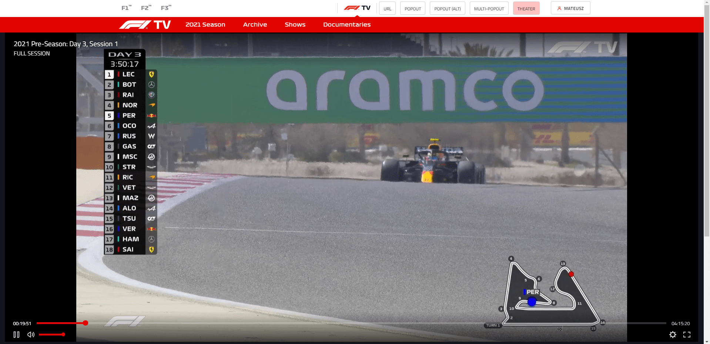
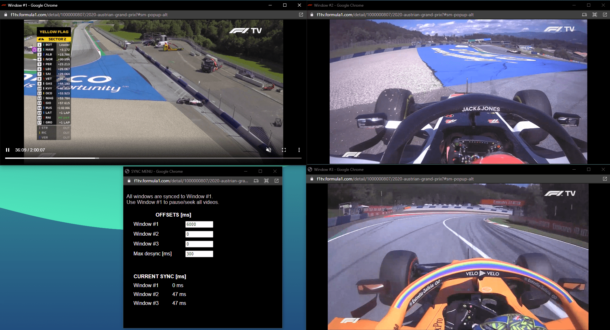

# F1TV+
Userscript that adds some useful features to F1TV.

All in your browser, no external apps needed.

## Current features
* theater mode (bigger video, less wasted space on screen),
* get video/stream URL (to use in external player, like VLC)
* open video in popup (keep "original" F1TV player)
* open video in popup in alternative mode (use default HTML5 player)
* "multi-popout" - open multiple popups with synchronized streams
  * In multi-popout mode, you can set offset for each video, to keep them perfectly synchronized in case they are hosted out-of-sync (the main feed is usually a few seconds behind other feeds).

## Installation
* Install the Tampermonkey extension for your browser:
  * [Google Chrome](https://chrome.google.com/webstore/detail/tampermonkey/dhdgffkkebhmkfjojejmpbldmpobfkfo)
  * [Microsoft Edge](https://microsoftedge.microsoft.com/addons/detail/tampermonkey/iikmkjmpaadaobahmlepeloendndfphd)
  * [Mozilla Firefox](https://addons.mozilla.org/en-US/firefox/addon/tampermonkey/)
* Click here to open the latest version of userscript: [[f1tv_plus.user.js]](https://github.com/najdek/f1tv_plus/raw/main/f1tv_plus.user.js)
* Tampermonkey should detect userscript automatically. Click on "Install".

You may have to allow F1TV website to open popups.

## Screenshots

## ❤ Donations
If you like the extension and would like to support me.

- **BTC:** `bc1qumjflpu6w6ydk37xepslfy75ul63qmwe32qem2`
- **ETH:** `0x38e3a4Cb21Fb78E67C7C3e56e79c535B85868632`
- **BCH:** `qppc8dmy8sxzlpwu9wae9mcnpklf78rhac2r5kfw9p`
- **LTC:** `ltc1qgkq26d6s55uq3tuc4z3u5u3yg3s4ewuz7lf4e2`
- **NANO:** `nano_1yxwrsqct1cbhj84wdjeecndr5hn3djz9o5z41wqo3crpkr96gx71hnrtfky`

All donations are greatly appreciated.
