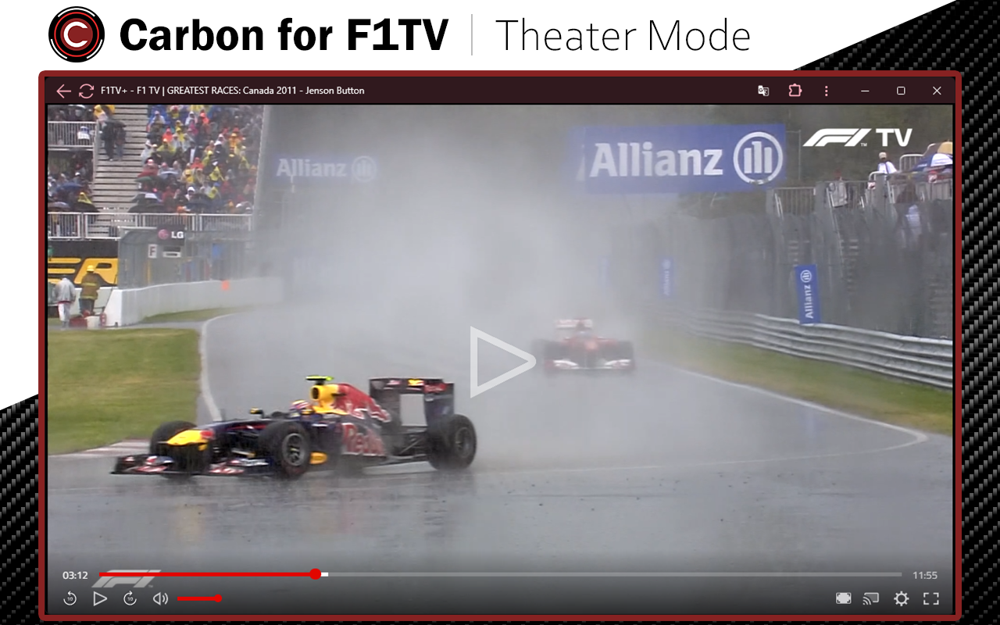

# Carbon for F1TV
(Formerly F1TV+)

Enhance your F1TV experience with this extension! Enjoy theater mode for full-screen viewing and sync mode for simultaneous playback of multiple streams.

## Installation

### Browser Extension (recommended)
[Download extension for your browser](https://carbon-for-f1tv.github.io/)

### Userscript (alternative method)
* Install extension for loading userscripts in your browser:
  * Google Chrome: [[Violent Monkey]](https://chromewebstore.google.com/detail/violentmonkey/jinjaccalgkegednnccohejagnlnfdag)
  * Microsoft Edge: [[Violent Monkey]](https://microsoftedge.microsoft.com/addons/detail/violentmonkey/eeagobfjdenkkddmbclomhiblgggliao)
  * Mozilla Firefox: [[Violent Monkey]](https://addons.mozilla.org/firefox/addon/violentmonkey/)
* Click here to get the latest version of userscript: [[carbon-for-f1tv.user.js]](https://github.com/Carbon-for-F1TV/Carbon-for-F1TV/raw/master/extension/carbon-for-f1tv.user.js)

## Screenshots

This extension is a free, non-commercial, fanmade project. It is not affiliated with Formula 1, FIA, Grand Prix, or any related entities. A paid F1TV subscription is required to use this extension.
